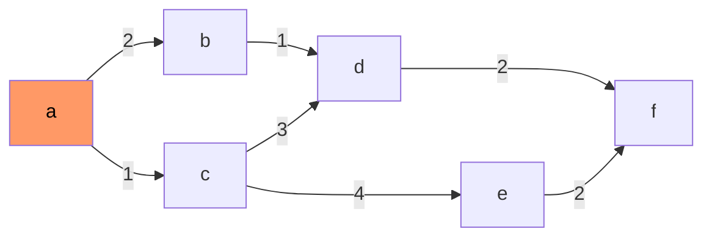
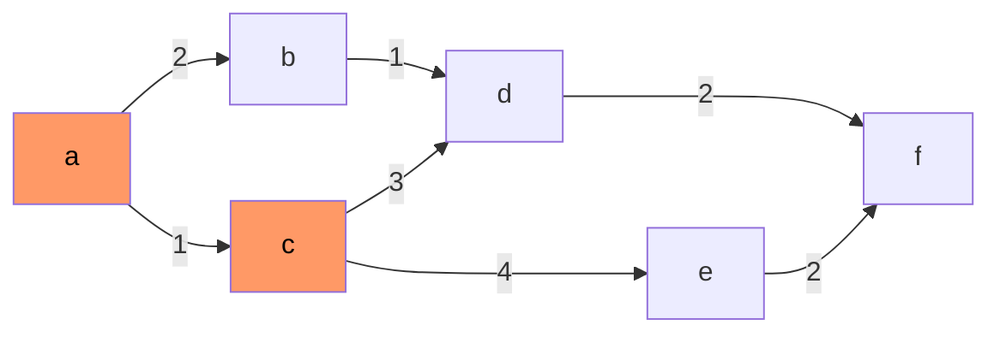
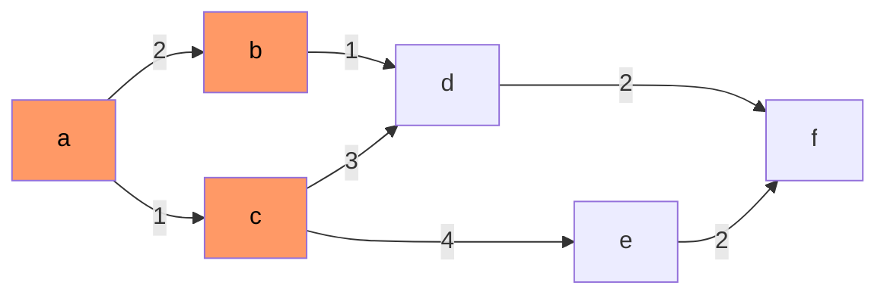
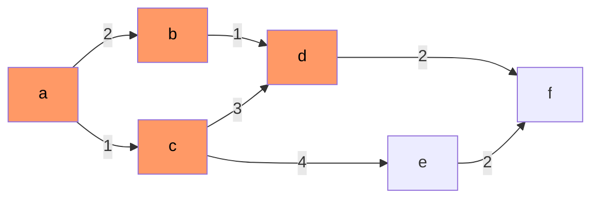
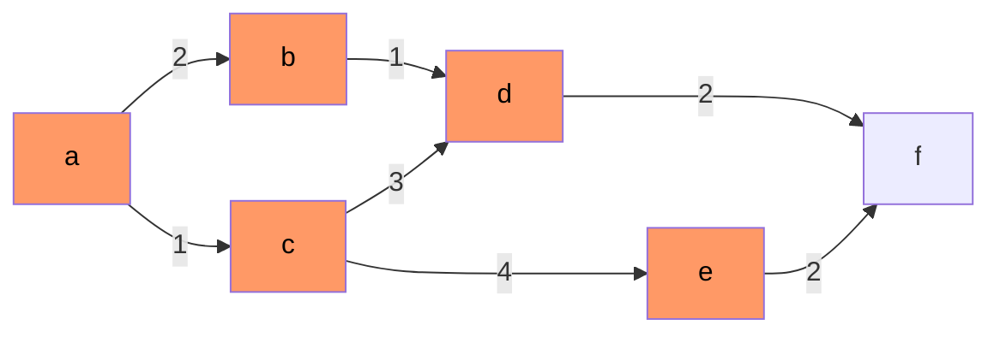
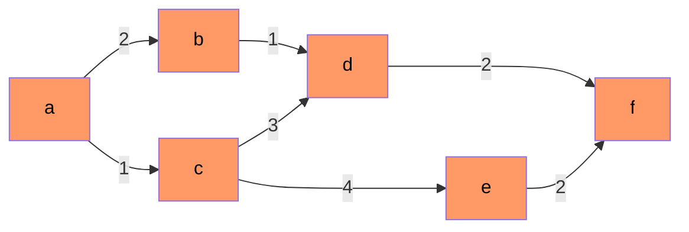

---
{"dg-publish":true,"permalink":"/Faculdade/5 Periodo/Teoria dos Grafos/Sub-Notes/Algoritmo de Dijkstra/","created":"2024-07-08T21:12:33.344-03:00"}
---

## Todos os passos

|   iter  |  visitado   | a     | b     | c     | d     | e     | f   |
| --- | --- | ----- | ----- | ----- | ----- | ----- | --- |
| 1º  | a   | (0,-) | **(2,a)** | **(1,a)** | ∞     | ∞     | ∞   |

|   iter  | visitado    | a     | b     | c     | d     | e     | f   |
| --- | --- | ----- | ----- | ----- | ----- | ----- | --- |
| 1º  | a   | (0,-) | (2,a) | (1,a) | ∞     | ∞     | ∞   |
| 2º  | c   | (0,-) | (2,a) | (1,a) | **(4,c)** | **(5,c)** | ∞   |

| iter | visitado | a     | b     | c     | d     | e     | f   |
| ---- | -------- | ----- | ----- | ----- | ----- | ----- | --- |
| 1º   | a        | (0,-) | (2,a) | (1,a) | ∞     | ∞     | ∞   |
| 2º   | c        | (0,-) | (2,a) | (1,a) | (4,c) | (5,c) | ∞   |
| 3º   | b        | (0,-) | (2,a) | (1,a) | *(3,b)* | (5,c) | ∞   |

| iter | visitado | a     | b     | c     | d       | e     | f   |
| ---- | -------- | ----- | ----- | ----- | ------- | ----- | --- |
| 1º   | a        | (0,-) | (2,a) | (1,a) | ∞       | ∞     | ∞   |
| 2º   | c        | (0,-) | (2,a) | (1,a) | (4,c)   | (5,c) | ∞   |
| 3º   | b        | (0,-) | (2,a) | (1,a) | (3,b)   | (5,c) | ∞   |
| 4º   | d        | (0,-) | (2,a) | (1,a) | (3,b) | (5,c) | **(5,d)**  |

| iter | visitado | a     | b     | c     | d       | e     | f   |
| ---- | -------- | ----- | ----- | ----- | ------- | ----- | --- |
| 1º   | a        | (0,-) | (2,a) | (1,a) | ∞       | ∞     | ∞   |
| 2º   | c        | (0,-) | (2,a) | (1,a) | (4,c)   | (5,c) | ∞   |
| 3º   | b        | (0,-) | (2,a) | (1,a) | (3,b)   | (5,c) | ∞   |
| 4º   | d        | (0,-) | (2,a) | (1,a) | (3,b) | (5,c) | (5,d)  |
| 5º   |   e      | (0,-) | (2,a) | (1,a) | (3,b) | (5,c) | (5,d)  |
| 6º   |     f     | (0,-) | (2,a) | (1,a) | (3,b) | (5,c) | (5,d)  |

| iter | visitado | a     | b     | c     | d       | e     | f   |
| ---- | -------- | ----- | ----- | ----- | ------- | ----- | --- |
| 1º   | a        | (0,-) | (2,a) | (1,a) | ∞       | ∞     | ∞   |
| 2º   | c        | (0,-) | (2,a) | (1,a) | (4,c)   | (5,c) | ∞   |
| 3º   | b        | (0,-) | (2,a) | (1,a) | (3,b)   | (5,c) | ∞   |
| 4º   | d        | (0,-) | (2,a) | (1,a) | (3,b) | (5,c) | (5,d)  |
| 5º   |   e      | (0,-) | (2,a) | (1,a) | (3,b) | (5,c) | (5,d)  |
| 6º   |     f     | (0,-) | (2,a) | (1,a) | (3,b) | (5,c) | (5,d)  |

### Resposta menor custo
Rota de A até F = A->B->D->F

