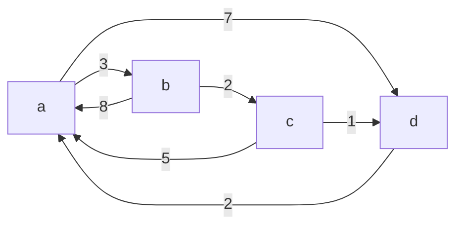

---
{"dg-publish":true,"permalink":"/Faculdade/5 Periodo/Teoria dos Grafos/Sub-Notes/Algoritmo de Floyd/","created":"2024-07-08T21:53:03.703-03:00"}
---

$$
M^0 =
\begin{vmatrix}
    \textcolor{red}{A}\\ \textcolor{red}{B}  \\ \textcolor{red}{C}  \\ \textcolor{red}{D} 
\end{vmatrix}
\begin{bmatrix}
    \textcolor{white}{0}  & \textcolor{white}{3}  & \textcolor{white}{\infty} & \textcolor{white}{7}\\
    \textcolor{white}{8}  & \textcolor{white}{0}  & \textcolor{white}{2} & \textcolor{white}{\infty}\\ 
    \textcolor{white}{5}  & \textcolor{white}{\infty }& \textcolor{white}{0}  & \textcolor{white}{1}\\
    \textcolor{white}{2}  & \textcolor{white}{\infty} & \textcolor{white}{\infty} & \textcolor{white}{0} \\
\end{bmatrix}
$$

$$
\text{} dij \gt dik + dkj = \begin{cases}
    sim,   & \text{dij = dik + dkj }\\
    não & \text{mantem-se}
\end{cases}
$$

---

$$
\textcolor{lightblue}{k = A } 

$$

$$
M^0 =
\begin{vmatrix}
    \textcolor{red}{A}\\ \textcolor{red}{B}  \\ \textcolor{red}{C}  \\ \textcolor{red}{D} 
\end{vmatrix}
\begin{bmatrix}
    \textcolor{blue}{0}  & \textcolor{blue}{3}  & \textcolor{blue}{\infty} & \textcolor{blue}{7}\\
    \textcolor{blue}{8}  & \textcolor{blue}{0}  & \textcolor{white}{2} & \textcolor{white}{\infty}\\ 
    \textcolor{blue}{5}  & \textcolor{white}{\infty }& \textcolor{blue}{0}  & \textcolor{white}{1}\\
    \textcolor{blue}{2}  & \textcolor{white}{\infty} & \textcolor{white}{\infty} & \textcolor{blue}{0} \\
\end{bmatrix}
\hspace{1cm}
M^1 =
\begin{vmatrix}
     \textcolor{green}{A}\\ \textcolor{green}{B}  \\ \textcolor{green}{C}  \\ \textcolor{green}{D} 
\end{vmatrix}
\begin{bmatrix}
    \textcolor{white}{0}  & \textcolor{white}{3}  & \textcolor{white}{\infty} & \textcolor{white}{7}\\
    \textcolor{white}{8}  & \textcolor{white}{0}  & \textcolor{white}{2} & \textcolor{white}{\infty}\\ 
    \textcolor{white}{5}  & \textcolor{white}{\infty }& \textcolor{white}{0}  & \textcolor{white}{1}\\
    \textcolor{white}{2}  & \textcolor{white}{\infty} & \textcolor{white}{\infty} & \textcolor{white}{0} \\
\end{bmatrix}
$$

$$
\textcolor{lightblue}{k = A }
\hspace{1cm}
\textcolor{orange}{i = B } 
\hspace{1cm}
\textcolor{yellow}{j = C } 
$$

$$
M^0 =
\begin{vmatrix}
    \textcolor{red}{A}\\ \textcolor{red}{B}  \\ \textcolor{red}{C}  \\ \textcolor{red}{D} 
\end{vmatrix}
\begin{bmatrix}
    \textcolor{blue}{0}  & \textcolor{blue}{3}  & \textcolor{yellow}{\infty} & \textcolor{blue}{7}\\
    \textcolor{orange}{8}  & \textcolor{blue}{0}  & \textcolor{red}{2} & \textcolor{white}{\infty}\\ 
    \textcolor{blue}{5}  & \textcolor{white}{\infty }& \textcolor{blue}{0}  & \textcolor{white}{1}\\
    \textcolor{blue}{2}  & \textcolor{white}{\infty} & \textcolor{white}{\infty} & \textcolor{blue}{0} \\
\end{bmatrix}
\hspace{1cm}
M^1 =
\begin{vmatrix}
     \textcolor{green}{A}\\ \textcolor{green}{B}  \\ \textcolor{green}{C}  \\ \textcolor{green}{D} 
\end{vmatrix}
\begin{bmatrix}
    \textcolor{white}{0}  & \textcolor{white}{3}  & \textcolor{white}{\infty} & \textcolor{white}{7}\\
    \textcolor{white}{8}  & \textcolor{white}{0}  & \textcolor{white}{2} & \textcolor{white}{\infty}\\ 
    \textcolor{white}{5}  & \textcolor{white}{\infty }& \textcolor{white}{0}  & \textcolor{white}{1}\\
    \textcolor{white}{2}  & \textcolor{white}{\infty} & \textcolor{white}{\infty} & \textcolor{white}{0} \\
\end{bmatrix}
$$

$$
\text{} \textcolor{red}{2} \gt \textcolor{orange}{8} + \textcolor{yellow}{∞} = \begin{cases}
    sim,   & \text{dij = dik + dkj }\\
    \textcolor{red}{não} & \textcolor{red}{mantem-se}
\end{cases}
$$

$$
\textcolor{lightblue}{k = A }
\hspace{1cm}
\textcolor{orange}{i = B } 
\hspace{1cm}
\textcolor{yellow}{j = D } 
$$

$$
M^0 =
\begin{vmatrix}
    \textcolor{red}{A}\\ \textcolor{red}{B}  \\ \textcolor{red}{C}  \\ \textcolor{red}{D} 
\end{vmatrix}
\begin{bmatrix}
    \textcolor{blue}{0}  & \textcolor{blue}{3}  & \textcolor{blue}{\infty} & \textcolor{yellow}{7}\\
    \textcolor{orange}{8}  & \textcolor{blue}{0}  & \textcolor{white}{2} & \textcolor{red}{\infty}\\ 
    \textcolor{blue}{5}  & \textcolor{white}{\infty }& \textcolor{blue}{0}  & \textcolor{white}{1}\\
    \textcolor{blue}{2}  & \textcolor{white}{\infty} & \textcolor{white}{\infty} & \textcolor{blue}{0} \\
\end{bmatrix}
\hspace{1cm}
M^1 =
\begin{vmatrix}
     \textcolor{green}{A}\\ \textcolor{green}{B}  \\ \textcolor{green}{C}  \\ \textcolor{green}{D} 
\end{vmatrix}
\begin{bmatrix}
    \textcolor{white}{0}  & \textcolor{white}{3}  & \textcolor{white}{\infty} & \textcolor{white}{7}\\
    \textcolor{white}{8}  & \textcolor{white}{0}  & \textcolor{white}{2} & \textcolor{green}{15}\\ 
    \textcolor{white}{5}  & \textcolor{white}{\infty }& \textcolor{white}{0}  & \textcolor{white}{1}\\
    \textcolor{white}{2}  & \textcolor{white}{\infty} & \textcolor{white}{\infty} & \textcolor{white}{0} \\
\end{bmatrix}
$$

$$
\text{} \textcolor{red}{\infty} \gt \textcolor{orange}{8} + \textcolor{yellow}{7} = \begin{cases}
    \textcolor{green}{sim,}   & \textcolor{green}{dij = dik + dkj = 8 + 7 = 15 }\\
    não & \text{mantem-se}
\end{cases}
$$

$$
\textcolor{lightblue}{Resumindo  \hspace{2mm} k = A }
$$

$$
M^0 =
\begin{vmatrix}
    \textcolor{red}{A}\\ \textcolor{red}{B}  \\ \textcolor{red}{C}  \\ \textcolor{red}{D} 
\end{vmatrix}
\begin{bmatrix}
    \textcolor{blue}{0}  & \textcolor{blue}{3}  & \textcolor{blue}{\infty} & \textcolor{blue}{7}\\
    \textcolor{blue}{8}  & \textcolor{blue}{0}  & \textcolor{white}{2} & \textcolor{white}{\infty}\\ 
    \textcolor{blue}{5}  & \textcolor{white}{\infty }& \textcolor{blue}{0}  & \textcolor{white}{1}\\
    \textcolor{blue}{2}  & \textcolor{white}{\infty} & \textcolor{white}{\infty} & \textcolor{blue}{0} \\
\end{bmatrix}
\hspace{1cm}
M^1 =
\begin{vmatrix}
     \textcolor{green}{A}\\ \textcolor{green}{B}  \\ \textcolor{green}{C}  \\ \textcolor{green}{D} 
\end{vmatrix}
\begin{bmatrix}
    \textcolor{white}{0}  & \textcolor{white}{3}  & \textcolor{white}{\infty} & \textcolor{white}{7}\\
    \textcolor{white}{8}  & \textcolor{white}{0}  & \textcolor{white}{2} & \textcolor{green}{15}\\ 
    \textcolor{white}{5}  & \textcolor{green}{8 }& \textcolor{white}{0}  & \textcolor{white}{1}\\
    \textcolor{white}{2}  & \textcolor{green}{5} & \textcolor{white}{\infty} & \textcolor{white}{0} \\
\end{bmatrix}
$$

---

$$
\text{Repete o processo para os seguintes passos}
$$

$$
\textcolor{lightblue}{Resumindo  \hspace{2mm} k = B }
$$

$$
M^0 =
\begin{vmatrix}
    \textcolor{red}{A}\\ \textcolor{red}{B}  \\ \textcolor{red}{C}  \\ \textcolor{red}{D} 
\end{vmatrix}
\begin{bmatrix}
    \textcolor{blue}{0}  & \textcolor{blue}{3}  & \textcolor{white}{\infty} & \textcolor{white}{7}\\
    \textcolor{blue}{8}  & \textcolor{blue}{0}  & \textcolor{blue}{2} & \textcolor{blue}{15}\\ 
    \textcolor{white}{5}  & \textcolor{blue}{8 }& \textcolor{white}{0}  & \textcolor{white}{1}\\
    \textcolor{white}{2}  & \textcolor{blue}{5} & \textcolor{white}{\infty} & \textcolor{blue}{0} \\
\end{bmatrix}
\hspace{1cm}
M^1 =
\begin{vmatrix}
     \textcolor{green}{A}\\ \textcolor{green}{B}  \\ \textcolor{green}{C}  \\ \textcolor{green}{D} 
\end{vmatrix}
\begin{bmatrix}
    \textcolor{white}{0}  & \textcolor{white}{3}  & \textcolor{white}{\infty} & \textcolor{white}{7}\\
    \textcolor{white}{8}  & \textcolor{white}{0}  & \textcolor{white}{2} & \textcolor{green}{15}\\ 
    \textcolor{white}{5}  & \textcolor{green}{8 }& \textcolor{white}{0}  & \textcolor{white}{1}\\
    \textcolor{white}{2}  & \textcolor{green}{5} & \textcolor{white}{\infty} & \textcolor{white}{0} \\
\end{bmatrix}
$$

---

$$
\text{Repete o processo para os seguintes passos}
$$

$$
\textcolor{lightblue}{Resumindo  \hspace{2mm} k = C }
$$

$$
M^0 =
\begin{vmatrix}
    \textcolor{red}{A}\\ \textcolor{red}{B}  \\ \textcolor{red}{C}  \\ \textcolor{red}{D} 
\end{vmatrix}
\begin{bmatrix}
    \textcolor{blue}{0}  & \textcolor{white}{3}  & \textcolor{blue}{\infty} & \textcolor{white}{7}\\
    \textcolor{white}{8}  & \textcolor{blue}{0}  & \textcolor{blue}{2} & \textcolor{white}{\infty}\\ 
    \textcolor{blue}{5}  & \textcolor{blue}{\infty }& \textcolor{blue}{0}  & \textcolor{blue}{1}\\
    \textcolor{white}{2}  & \textcolor{white}{\infty} & \textcolor{blue}{\infty} & \textcolor{blue}{0} \\
\end{bmatrix}
\hspace{1cm}
M^1 =
\begin{vmatrix}
     \textcolor{green}{A}\\ \textcolor{green}{B}  \\ \textcolor{green}{C}  \\ \textcolor{green}{D} 
\end{vmatrix}
\begin{bmatrix}
    \textcolor{white}{0}  & \textcolor{white}{3}  & \textcolor{white}{\infty} & \textcolor{white}{7}\\
    \textcolor{white}{8}  & \textcolor{white}{0}  & \textcolor{white}{2} & \textcolor{green}{15}\\ 
    \textcolor{white}{5}  & \textcolor{green}{8 }& \textcolor{white}{0}  & \textcolor{white}{1}\\
    \textcolor{white}{2}  & \textcolor{green}{5} & \textcolor{white}{\infty} & \textcolor{white}{0} \\
\end{bmatrix}
$$
---

$$
\text{Repete o processo para os seguintes passos}
$$

$$
\textcolor{lightblue}{Resumindo  \hspace{2mm} k = E }
$$

$$
M^0 =
\begin{vmatrix}
    \textcolor{red}{A}\\ \textcolor{red}{B}  \\ \textcolor{red}{C}  \\ \textcolor{red}{D} 
\end{vmatrix}
\begin{bmatrix}
    \textcolor{blue}{0}  & \textcolor{white}{3}  & \textcolor{white}{\infty} & \textcolor{blue}{7}\\
    \textcolor{white}{8}  & \textcolor{blue}{0}  & \textcolor{white}{2} & \textcolor{blue}{\infty}\\ 
    \textcolor{white}{5}  & \textcolor{white}{\infty }& \textcolor{blue}{0}  & \textcolor{blue}{1}\\
    \textcolor{blue}{2}  & \textcolor{blue}{\infty} & \textcolor{blue}{\infty} & \textcolor{blue}{0} \\
\end{bmatrix}
\hspace{1cm}
M^1 =
\begin{vmatrix}
     \textcolor{green}{A}\\ \textcolor{green}{B}  \\ \textcolor{green}{C}  \\ \textcolor{green}{D} 
\end{vmatrix}
\begin{bmatrix}
    \textcolor{white}{0}  & \textcolor{white}{3}  & \textcolor{white}{\infty} & \textcolor{white}{7}\\
    \textcolor{white}{8}  & \textcolor{white}{0}  & \textcolor{white}{2} & \textcolor{green}{15}\\ 
    \textcolor{white}{5}  & \textcolor{green}{8 }& \textcolor{white}{0}  & \textcolor{white}{1}\\
    \textcolor{white}{2}  & \textcolor{green}{5} & \textcolor{white}{\infty} & \textcolor{white}{0} \\
\end{bmatrix}
$$
