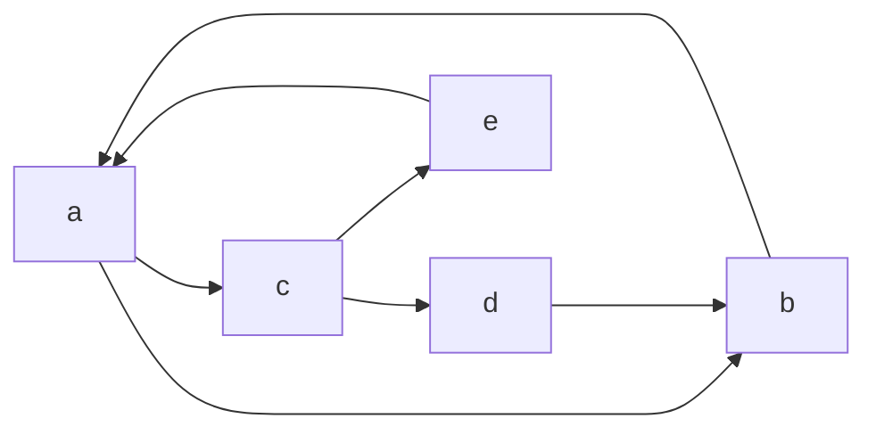

---
{"dg-publish":true,"permalink":"/Faculdade/5 Periodo/Teoria dos Grafos/Sub-Notes/Conceitos Básicos/","tags":["grafos"],"created":"2024-03-17T17:45:56.868-03:00"}
---

## Tópicos
1. [[Faculdade/5 Periodo/Teoria dos Grafos/Sub-Notes/Conceitos Básicos#Definições e Exemplos\|Definições e Exemplos]]
	1. [[Faculdade/5 Periodo/Teoria dos Grafos/Sub-Notes/Conceitos Básicos#Arestas\|Arestas]]
	2. [[Faculdade/5 Periodo/Teoria dos Grafos/Sub-Notes/Conceitos Básicos#Graus\|Graus]]
		1. [[Faculdade/5 Periodo/Teoria dos Grafos/Sub-Notes/Conceitos Básicos#Definição de grau\|Definição de grau]]
		2. [[Faculdade/5 Periodo/Teoria dos Grafos/Sub-Notes/Conceitos Básicos#Grau de Entrada ou Saída\|Grau de Entrada ou Saída]]
		3. [[Faculdade/5 Periodo/Teoria dos Grafos/Sub-Notes/Conceitos Básicos#Soma dos graus\|Soma dos graus]]
	3. [[Faculdade/5 Periodo/Teoria dos Grafos/Sub-Notes/Conceitos Básicos#Ordem, Tamanho e Rótulo\|Ordem, Tamanho e Rótulo]]
	4. [[Faculdade/5 Periodo/Teoria dos Grafos/Sub-Notes/Conceitos Básicos#Direcionado ou Orientado\|Direcionado ou Orientado]]
2. [[Faculdade/5 Periodo/Teoria dos Grafos/Sub-Notes/Conceitos Básicos#Teoremas\|Teoremas]]
	1. [[Faculdade/5 Periodo/Teoria dos Grafos/Sub-Notes/Conceitos Básicos#Teorema 1\|Teorema 1]]
---
- **Notações**:
	- *G*: Grafo com conjunto de vértices V(G) e conjunto de arestas E(G).
	- *n*: Número de vértices de G.
	- *m*: Número de arestas de G.

## Definições e Exemplos
### Arestas
- **Incidentes**: Os extremos de uma aresta são ditos incidentes com a aresta
- **Adjacentes**: Dois vértices que são incidentes a uma mesma aresta são ditos adjacentes.

- **Loop** (LAÇO): uma aresta com extremos idênticos.

- **Link** (enlace): aresta com extremos diferentes.

- **Arestas Múltiplas**: mais de uma aresta com os mesmos extremos. 

- **Arestas paralelas**: duas arestas com os mesmos extremos.

### Graus

#### Definição de grau
- **Definição:** O grau de um vértice v, denotado por d(v), é o número de arestas incidentes a esse vértice v .
	- Grafos com apenas um vértice são ditos *triviais*.
	- Um grafo é *simples* se não possuir laços e arestas múltiplas. 
	

| vertices | Arestas |
| -------- | ------- |
| d(u)     | 1       |
| d(v)     | 4       |
| d(w)     | 2       |
| d(z)     | 0        |

- A **sequência de grau de um grafo** consiste em que os graus são escritos em ordem crescente.

$$
I
$$

$$
II
$$

$$
III
$$

<ol type="A" style="list-style-type:upper-roman;">
<li>Sequência de grau do grafo (i):  (1, 1, 2, 2, 2)</li>
<li>Sequência de grau do grafo (ii): (1, 1, 2, 2, 2)</li>
<li>Sequência de grau do grafo (iii):  (1, 3, 6, 8)</li>
</ol>

#### Grau de Entrada ou Saída
- **Grau de entrada**: o vértice é denotado **d⁻(v)⁺**.
	- O vértice é chamado de **fonte** (é a origem de suas arestas incidentes).
- **Grau de saída**: o vértice é denotado **d⁺(v)**.
	- O vértice é chamado de **sumidouro**.
	

#### Soma dos graus
- O grafo é chamado de dígrafo balanceado se:

$$
d⁻(v) = d⁺(v)
$$

- Exemplo:

| d⁻(v)     | d⁺(v)     |
| --------- | --------- |
| d⁻(a) = 2 | d⁺(v) = 2 |
| d⁻(b) = 2 | d⁺(v) = 2 |
| d⁻(c) = 1 | d⁺(v) = 3 |
| d⁻(d) = 1 | d⁺(v) = 0 |
| total = 6 | total = 6 | 

### Ordem, Tamanho e Rótulo
- Um grafo é dito **rotulado** se existem atribuições associadas a suas arestas ou vértices
- Denomina-se **ordem** de G a cardinalidade do seu conjunto de vértices. |V|= n.
- Denomina-se **tamanho** de G a cardinalidade do seu conjunto de arestas. |E|= m.

Grafo (1) ordem  5       e tamanho     8   . 
Grafo (2) ordem    4     e tamanho     4    .

### Direcionado ou Orientado
**Definição**: Um grafo é dito direcionado ou orientado ou, simplesmente,  *dígrafo* quando o *sentido das ligações entre os vértices é importante*. Nesse caso, as **arestas** possuem um sentido marcado por uma seta e recebem o nome de **arcos**.

## Teoremas
### Teorema 1
- Em **qualquer grafo**, a soma dos graus de um grafo **G = (V; E)** é igual a duas vezes o número de arestas
$$ \sum d(v_i) = 2 |E| = 2m$$

- **Exemplo:** Um grafo tem exatamente 4 vértices,  cada um de grau 3. Quantas arestas este grafo tem?

$$
\begin{aligned}
 \sum d(v_i) &= 4 \cdot 3 = 12  && \text (1)  \\
    \sum d(v_i) &= 2 |E|\\
    12     &= 2|E|        \\
    |E|     &= \frac{12}{2} \\
    |E| &= 6 \text{ arestas}
\end{aligned}
$$

> [!important] Importante
> **Corolário 1:** O número de vértices de grau impar é par (trivial). 
