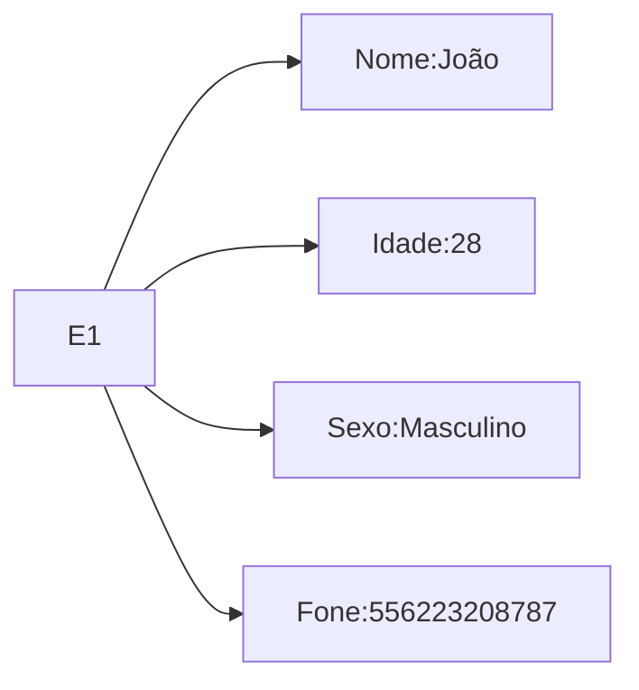
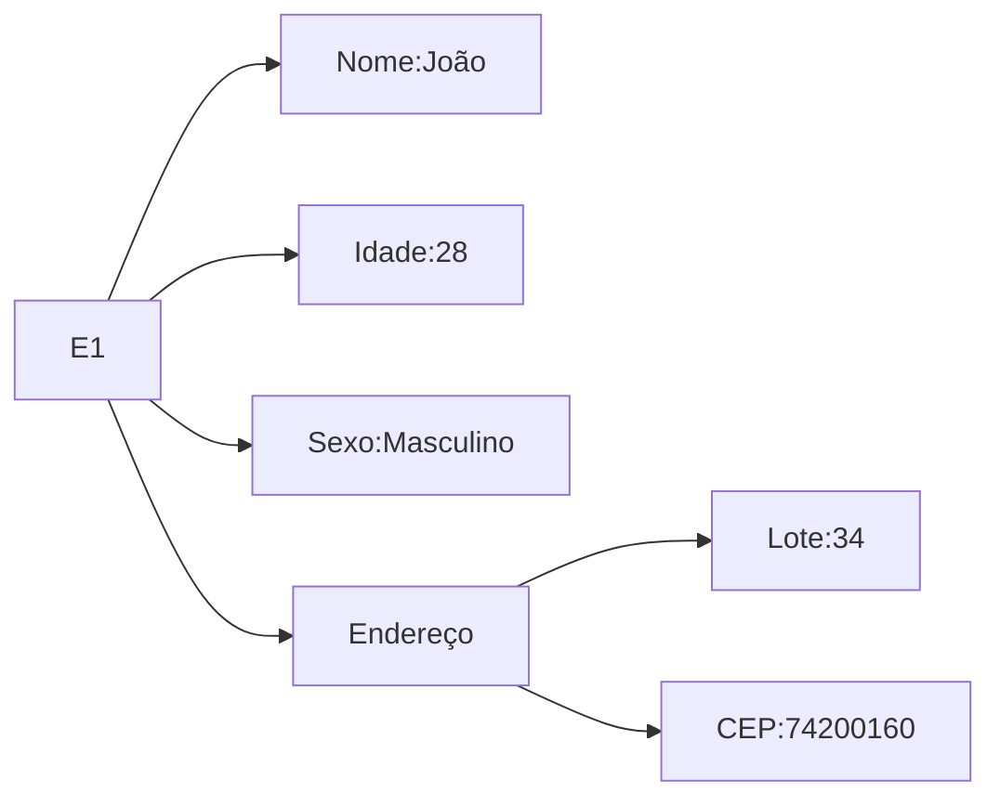

---
{"dg-publish":true,"tags":["BD"],"permalink":"/Faculdade/7 Periodo/Banco de Dados 2/Sub-Notes/Modelo Entidade Relacionamento/","dgPassFrontmatter":true}
---

## Atributo e Entidade
### Atributo
**São propriedades que descrevem uma entidade**
#### Exemplo:

#### Composto Vs Simples
- **Atributo Composto** representam atributos básico com significado independente

#### Valores possíveis
- **Valor NULL**
	- Desconhecido ou não aplicável
- **Chave primaria**
	- Atributo que possui *valor único* para cada entidade (instância)
		- Ex. Nome da companhia, identidade do empregado
- **Chave composta:**
	- Pode ser formada por vários atributos
		- Registro do Veículo: Número de Registro e Estado
### Entidade
**Define um conjunto de entidades que têm os mesmos atributos (propriedades)**
- Exemplo: O que uma entidade projeto possui?
	- Nome
	- Número
	- Localização
	- Departamento
- *Entidade Fraca*: Não tem chave própria
- *Padrões de nome* 
	- Tipo entidade: Nomes em singular e tudo maiúsculo
	- Atributo: Primeira letra maiúscula
	- Papeis: Tudo minúsculo
### Relacionamentos
 **Associações entre duas ou mais entidades distintas**

#### Tipos de Relacionamento
##### Auto-Relacionamento

##### Ternário

##### Atributo em relacionamento

#### Imagens de diagramas

